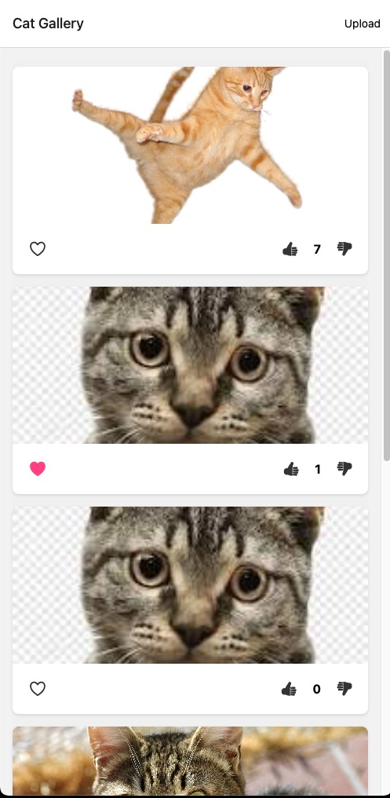
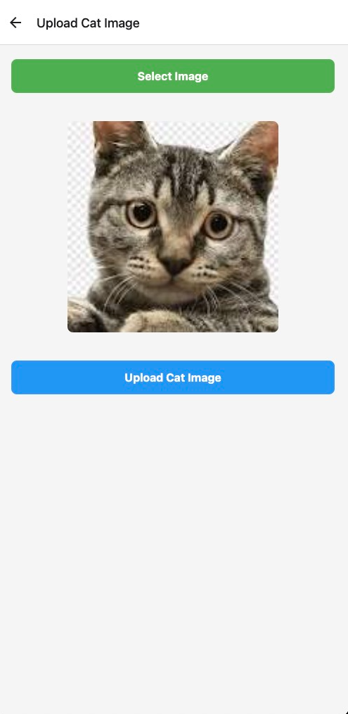
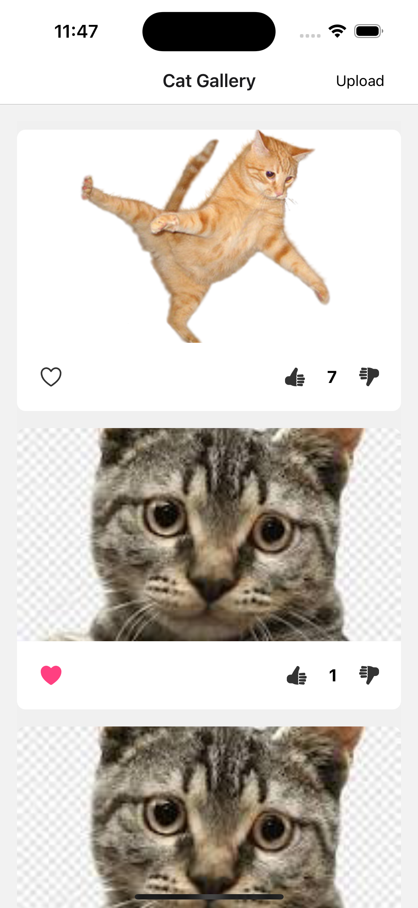
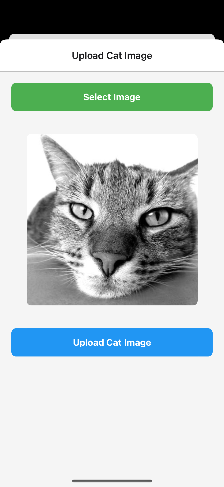

# Cattitude App (Cat Gallery App) 🐱

This is an [Expo](https://expo.dev) mobile/web application that allows users to browse, favorite, vote on, and upload cat images.

## Live Demo (web hosted link of the app)

https://cattitude-app.vercel.app/

## web App Screenshots

<div style="display: flex; flex-direction: row; flex-wrap: wrap; gap: 10px; justify-content: center;">
  
  
</div>

## Mobile App Screenshots

<div style="display: flex; flex-direction: row; flex-wrap: wrap; gap: 10px; justify-content: center;">
  
  
</div>

## App Demo Video

Check out the app in action:

<video width="320" height="240" controls>
  <source src="assets/videos/mobile-app.mov" type="video/quicktime">
  Your browser does not support the video tag.
</video>

## Features

- Browse a collection of cat images
- Mark favorite cat images and view your favorites
- Vote on cat images
- Upload your own cat images
- Optimistic UI updates for a smooth user experience

## Get started

1. Set up environment variables

   Copy the `.env.example` file to `.env` and fill in the required API keys.

   ```bash
   cp .env.example .env
   ```

2. Install dependencies

   ```bash
   npm install
   ```

3. Start the app

   ```bash
    npx expo start
   ```

In the output, you'll find options to open the app in a

- [development build](https://docs.expo.dev/develop/development-builds/introduction/)
- [Android emulator](https://docs.expo.dev/workflow/android-studio-emulator/)
- [iOS simulator](https://docs.expo.dev/workflow/ios-simulator/)
- [Expo Go](https://expo.dev/go), a limited sandbox for trying out app development with Expo

## Project Structure

- **/src/app**: Main application screens with file-based routing
- **/src/components**: Reusable UI components like CatCard, UploadForm, and Error
- **/src/services/api**: API service functions for interacting with the cat API
- **/src/store**: Zustand store configuration and slices for state management
- **/src/types**: TypeScript interfaces for the application
- **/src/utils**: Utility functions for common operations

## Key Components

- **CatCard**: Displays individual cat images with favorite and voting functionality
- **UploadForm**: Allows users to upload their own cat images
- **Error**: Error handling component for displaying error messages
